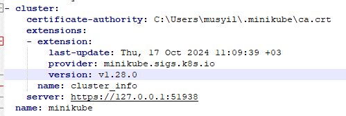
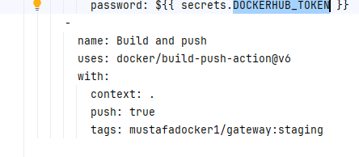
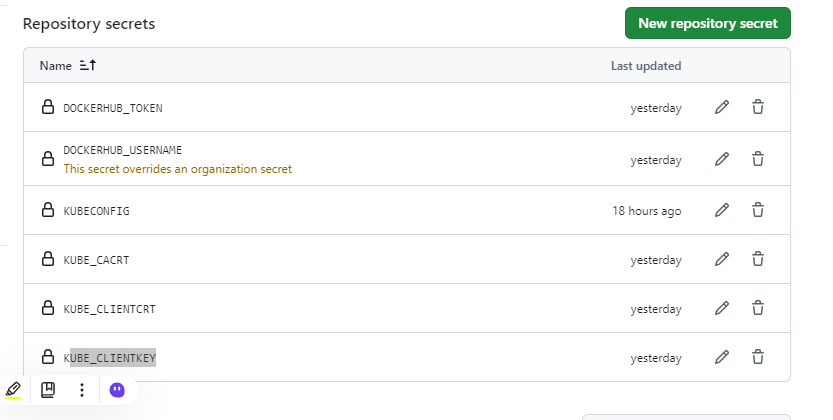
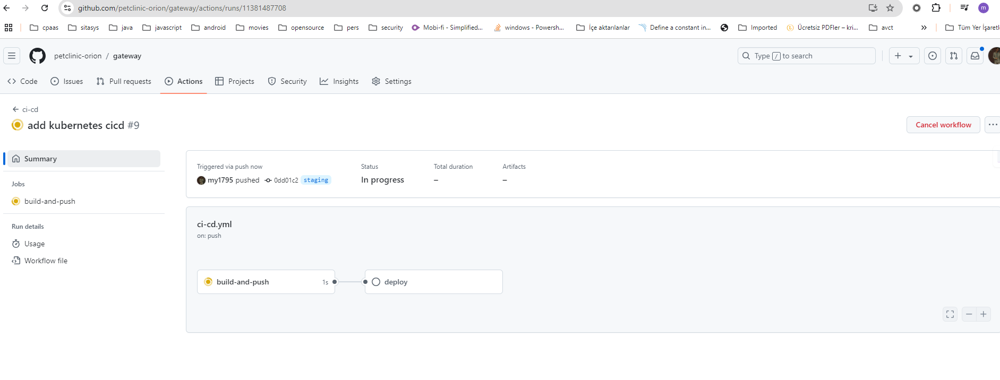
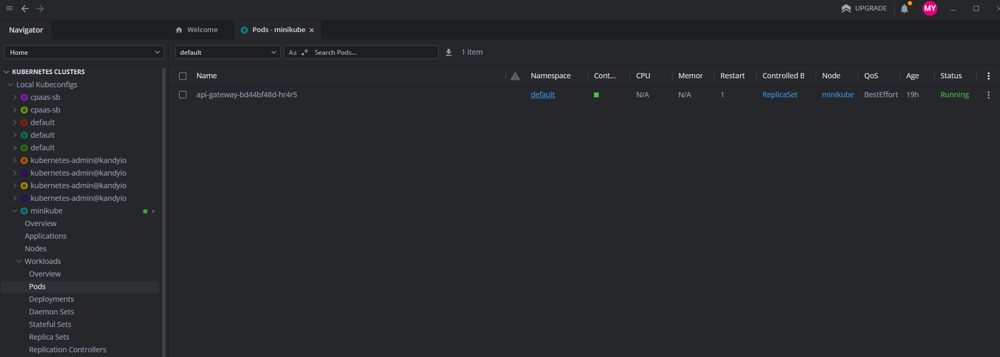

# Continious Deployment on Kubernetes 
related design docs https://drive.google.com/file/d/1_25R5sdOGWQX6NPO-DNAWW4kCqXKBDq-/view?usp=sharing  -> Github Actions Kubernetes local setup 

##  Prerequisites 
### Installations 
* https://minikube.sigs.k8s.io/docs/start/?arch=%2Fwindows%2Fx86-64%2Fstable%2F.exe+download
* https://ngrok.com/download
* https://k8slens.dev/download
* https://kompose.io/installation/

## Other Setup 
* Create account on https://hub.docker.com/ 
* Set kubectl cli https://minikube.sigs.k8s.io/docs/handbook/kubectl/
* Register to ngrok


##  Set Up 
* Kubernetes Manifest Creation 
  * Go to https://github.com/petclinic-orion/deploy  run `kompose --file docker-compose.yml convert`
* Copy api-gateway related manifests under deployment  in this repo 
* add related kubectl commands to .github/workflows/ci-cd.yml 
* Run `minikube start`
* Generate kube config for pipeline run  `kubectl config view --raw` and copy it somewhere else to modify
  * Get kubernetes url for pipeline config 
    * 
  * Get the port (In my case 51938 ) run `ngrok tcp 51938`
  * Copy Forwarding url (In my case 8.tcp.ngrok.io:13613 )
  * Replace server key with `server:  https://8.tcp.ngrok.io:13613`
* Generate secrets for github actions go to https://github.com/petclinic-orion/gateway/settings/secrets/actions 
  * docker secrets DOCKERHUB_USERNAME -> your docker username DOCKERHUB_TOKEN -> your docker password 
  * change your docker tags according to it under ci-cd.yml 
    * 
  * Copy file contents to secrets for kube config 
    * certificate-authority -> KUBE_CACRT 
    * client-certificate -> KUBE_CLIENTCRT 
    * client-key -> KUBE_CLIENTKEY 
  * At the end your secrets on github will look like this 
    *  
  * Your kube config will be like this
``` 
apiVersion: v1
clusters:
- cluster:
    certificate-authority: ca.crt
    extensions:
    - extension:
        last-update: Wed, 16 Oct 2024 10:27:38 +03
        provider: minikube.sigs.k8s.io
        version: v1.28.0
      name: cluster_info
    server:  https://8.tcp.ngrok.io:13613
  name: minikube
contexts:
- context:
    cluster: minikube
    extensions:
    - extension:
        last-update: Wed, 16 Oct 2024 10:27:38 +03
        provider: minikube.sigs.k8s.io
        version: v1.28.0
      name: context_info
    namespace: default
    user: minikube
  name: minikube
current-context: minikube
kind: Config
preferences: {}
users:
- name: minikube
  user:
     client-certificate: client.crt
     client-key: client.key
```
  * Copy this config to secret KUBECONFIG on github secrets

##  Deployment 
* Make changes on api-gateway repo on staging branch since it is defined on ci-cd.yml and push the changes you will see github actions running for this push 
* Monitor the deployment on actions page 
  * 
* Open kube lens app to monitor kubernetes cluster 
  * 

  
